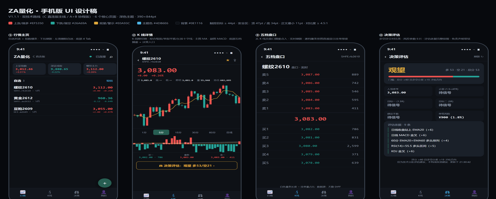
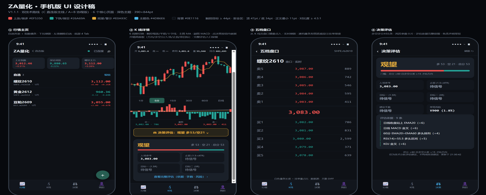
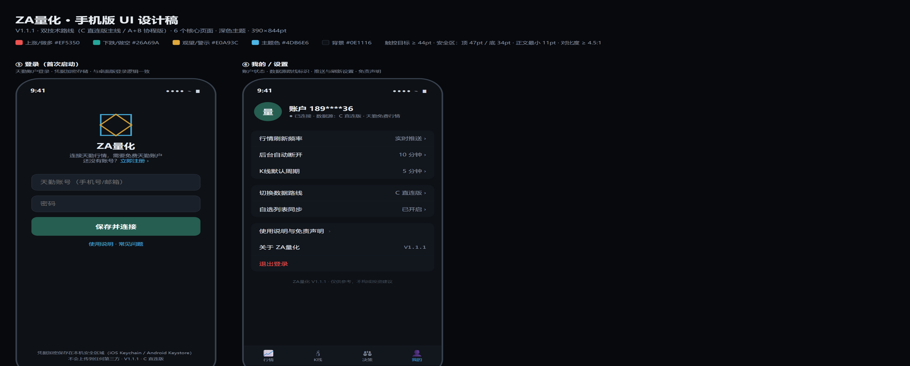

# ZA量化 手机版方案（docs/15）

> 版本 V1.1.1 · 配套设计稿：`design/手机版/`（HTML 源文件 + 高保真渲染图）
> 原则：**桌面版的所有功能一个不少**；设计按商业行业标准；技术选型以"复用现有代码"为第一优先。

---

## 0. 摘要与选型结论

| 方案 | 一句话 | 工期 | 结论 |
|---|---|---|---|
| **PWA（渐进式 Web 应用）** | 手机浏览器打开就是 App，可"添加到主屏幕" | **2~3 天** | ✅ **第一步先做** |
| **Capacitor 打包 App** | 把同一个前端装进原生壳，出 APK/AAB 上架或直接分发 | 5~7 天 | ✅ 第二步（要图标/商店/推送时做） |
| 原生重写（Flutter/RN） | 全部重写 | 1~2 月 | ❌ 不做（现有前端 100% 可复用，没必要） |

**核心架构决策（手机版与桌面版的唯一本质区别）**：
桌面版的后端跑在你自己的电脑上（`127.0.0.1:8000`）；手机上跑不了 Python 后端
（iOS 完全不允许后台常驻，Android 要 hack）。
所以手机版的行情数据来自**部署在云服务器上的同一个后端**（`api/` + `market/` + `tqdiff/` 原样上云），
手机 App 通过 HTTPS/WSS 访问它。**后端代码零改动，只加部署配置。**

```
┌──────────┐  HTTPS/WSS   ┌─────────────────────┐   DIFF 协议   ┌──────────┐
│ 手机 App  │ ───────────► │ 云服务器（Docker）    │ ───────────► │ 天勤行情  │
│ (PWA/    │ ◄─────────── │ api/ + market/       │ ◄──────────  │ 服务     │
│ Capacitor)│   实时推送    │ + tqdiff/（C 路线）   │              └──────────┘
└──────────┘              └─────────────────────┘
 桌面版继续用 127.0.0.1:8000 直连，互不影响
```

---

## 1. 功能对照表：桌面版有的，手机版一个不少

| # | 桌面版功能 | 手机版实现 | 状态 |
|---|---|---|---|
| 1 | 行情快照（最新价/涨跌/开高低/昨结/量/持仓） | K 线页顶部大字报价 + 关键数据条 | ✅ |
| 2 | 五档盘口（十档全量） | 独立盘口页：五档全保留 + 挂单量条形图 | ✅ |
| 3 | K 线 6 周期（1/5/15/30/60 分 + 日线） | 周期 Tab 一键切换，同样 6 个 | ✅ |
| 4 | 图表交互（缩放/平移/十字光标/双击复位） | 触控手势：捏合缩放、单指平移、长按十字线、双击复位 | ✅ |
| 5 | 主图 MA + 副图 MACD + 量/持仓 | 主图 MA 常驻 + 副图指标 Tab 切换（MACD/量/持仓） | ✅ |
| 6 | 决策评估（方向/多空评分/门槛） | 决策页完整保留：方向大字 + 多空对比条 + 门槛说明 | ✅ |
| 7 | 风控参数（入场/止损/目标 1.5R·3R/手数/单笔风险） | 风控参数卡片网格，一个不少 | ✅ |
| 8 | 评估依据（可解释性列表） | 评估依据列表完整保留 | ✅ |
| 9 | 免责声明 | 决策页常驻 + 关于页 | ✅ |
| 10 | 合约搜索（全市场 867 个） | 搜索页：代码/名称拼音首字母搜索 | ✅ |
| 11 | 自选列表（本地保存） | 行情主页自选 + 左滑删除 + 登录后云同步 | ✅ |
| 12 | 登录界面（天勤凭据保存复用） | 登录页：凭据加密存储（Keychain/Keystore 或云端加密） | ✅ |
| 13 | 路线标识（A+B / C）与状态 | 顶部连接状态 + 我的页路线显示与切换 | ✅ |
| 14 | 实时推送（WebSocket 变化驱动） | WSS 推送 + 心跳 + 指数退避重连 + 后台挂起策略 | ✅ |
| 15 | 自动退出保险（释放端口/内存） | 移动端改造为"后台超 10 分钟自动断开推送"（省电） | ✅ |
| 16 | 路线切换（A+B / C 两条数据路线） | 我的页"切换数据路线"（云端可同时部署两条路线实例） | ✅ |

**手机版新增（桌面版没有的）**：下拉刷新、涨跌提醒（可选）、指数横条、触控手势、应用图标。

---

## 2. 设计规范（行业商业标准）

依据：Apple《Human Interface Guidelines》+ Google《Material Design 3》+ 同类金融 App
（同花顺/文华财经/富途）的通用惯例。

### 2.1 尺寸与安全区
- 设计基准 **390×844pt**（iPhone 14/15 主流尺寸），适配 360dp（Android 主流）；
- **安全区**：顶部状态栏 47pt、底部 Home 指示条 34pt，内容不得侵入；
- **触控目标 ≥ 44×44pt**（Android ≥ 48dp）——所有按钮/列表行/Tab 已按此设计；
- 页面左右边距 16pt，卡片间距 10~14pt，卡片圆角 12~14pt。

### 2.2 字号阶梯
| 用途 | 字号 | 字重 |
|---|---|---|
| 最新价大字 | 32pt | Bold 800 |
| 页面标题 | 17~22pt | Bold |
| 列表主文字 | 15pt | Semibold |
| 次要信息/标签 | 10~12pt | Regular（**最小 10pt**，仅用于辅助标签） |
| 数字 | 等宽字体（SF Mono / Consolas）——价格跳动不抖动 | |

### 2.3 色彩系统（与桌面版同一套色板，品牌延续）
| 语义 | 色值 | 用途 |
|---|---|---|
| 上涨/做多 | `#EF5350` 红 | 涨幅、买盘、做多信号 |
| 下跌/做空 | `#26A69A` 绿 | 跌幅、卖盘、做空信号 |
| 观望/警示 | `#E0A93C` 琥珀 | 观望状态、风险提示 |
| 主题色 | `#4DB6E6` 青 | Tab 激活、链接、主按钮描边 |
| 主按钮 | `#275E52` | 保存并连接等主动作 |
| 背景/面板 | `#0E1116` / `#1A2029` | 深色主题（金融 App 标配，长时间盯盘不刺眼） |
| 正文/次要 | `#E8EDF2` / `#8B96A3` | 对比度 ≥ 4.5:1（可访问性达标） |

### 2.4 状态设计（商业 App 三态标配）
每个数据区域必须设计三种状态：**加载态**（骨架屏/转圈）、**空态**（"暂无自选，点 + 添加"）、
**错误态**（"连接断开，3 秒后重试" + 重试按钮）——桌面版已有的文案全部复用。

---

## 3. 信息架构与页面流

```
启动 → 未配置天勤账户？ → ⑤ 登录页 → 保存并连接
              │否
              ▼
        ① 行情主页（自选 + 指数横条）
   点列表行 ──► ② K 线详情 ──► 盘口摘要条 ──► ③ 五档盘口页
   底部 Tab ──► ④ 决策评估页（刷新/依据/免责）
   底部 Tab ──► ⑥ 我的/设置（账户/路线/刷新频率/退出）
   搜索 icon ──► 搜索页（全市场 867 合约）──► 选中回 K 线
```

---

## 4. UI 设计（6 屏）

设计稿源文件：`design/手机版/UI设计稿.html`（浏览器打开即是交互式设计板）。
高保真渲染图：

| 屏 | 截图 | 设计要点 |
|---|---|---|
| ① 行情主页 |  | 指数横条横向滚动；自选行 = 名称/代码 + 最新价 + 涨跌双行；右下 ＋ 添加自选；底部 4 Tab |
| ② K 线详情 | 同上（左 2） | 大字报价 → 关键数据条 → 蜡烛主图（MA 叠加）→ 周期 Tab → MACD 副图 → 五档摘要条 → **决策按钮点击内嵌展开精简面板**（方向/多空分/入场/止损/目标一/目标二 + 完整评估入口），展开态见下图 |



*精简面板内容：方向（观望/做多/做多色系）+ 多空分数对比条 + 入场参考/止损(1.5×ATR)/目标一(1.5R)/目标二(3R) 四宫格 + "查看完整评估"入口（跳转决策页看依据/手数/风险）。数据未就绪时显示"待信号"占位。* |
| ③ 五档盘口 | 同上（左 3） | 卖5→卖1 / 最新 / 买1→买5 十档全量；挂单量数字右对齐等宽字体 |
| ④ 决策评估 | 同上（左 4） | 方向大字 + 多空对比条 + 门槛说明 → 风控 6 卡网格 → 评估依据列表 → 免责声明 |
| ⑤ 登录 |  | 品牌双正方形 logo → 账号/密码 → 保存并连接 → 凭据加密存储说明 |
| ⑥ 我的/设置 | 同上（右 1） | 账户掩码 + 路线徽章 → 三组设置行 → 退出登录（红色危险项） |

---

## 5. 技术实现（打包成手机版的完整方法）

### 5.1 后端上云（手机版的前提，2~3 天）

**为什么**：手机 OS 不允许后台常驻 Python 进程（iOS 禁止；Android 常驻会被杀），
所以 `api/ + market/ + tqdiff/` 要部署到一台云服务器（轻量 VPS 即可：2 核 2G，¥50~100/月）。

**部署步骤（C 直连版路线，无 TqSdk 依赖最轻）**：
1. VPS 装 Docker，写 `Dockerfile`：`python:3.13-slim` + `pip install -r requirements.txt`
   + 复制代码 + `CMD ["python", "main.py"]`；
2. `docker compose up -d`（重启自动拉起——顺带解决桌面版的进程看护）；
3. HTTPS：前面挂 **Caddy**（两行配置自动申请证书），WebSocket 自动升级为 **WSS**；
4. 天勤凭据：首次通过登录接口提交，服务端存加密文件（与桌面版同一套逻辑）；
5. 防火墙只开 443；**务必加访问密码或 IP 白名单**（行情服务不能裸奔在公网）。

> 桌面版不受影响：`127.0.0.1:8000` 直连天勤；手机版走云端。**一套代码，两种部署**。

### 5.2 前端复用（现有 static/ 改造清单，1~2 天）

现有前端是原生 JS，改造成手机版只需：
1. `<meta name="viewport" content="width=device-width, initial-scale=1, viewport-fit=cover">`（已有一半）；
2. 布局改造：桌面三栏 → 手机单栏 + 底部 Tab（按设计稿重排 HTML，**渲染函数/状态层全部复用**）；
3. 图表：ECharts 本身支持触控（`dataZoom inside` = 捏合缩放已内置），加 `longpress` 十字线；
4. 事件改造：`click` → `touchstart/touchend`、左滑删除（touch 事件判断方向）；
5. `fetchJSON`/WebSocket 重连逻辑**原样复用**（URL 从 `127.0.0.1` 换成云域名）。

### 5.3 方案一：PWA（2~3 天，最快见效）

1. 加 `manifest.json`（名称/图标/主题色/standalone 模式）；
2. 加 Service Worker（缓存静态资源，行情数据不缓存）；
3. iOS：Safari 打开 → 分享 → "添加到主屏幕"；Android：Chrome → "安装应用"。
- ✅ 得到：主屏幕图标、全屏无地址栏、离线壳；
- ⚠️ 限制：不在应用商店、无推送通知（iOS 16.4+ 的 Web Push 需用户添加到主屏后才可用）。

### 5.4 方案二：Capacitor 打包 App（5~7 天，可上架/直接发 APK）

[Capacitor](https://capacitorjs.com) 是 Ionic 出品的"Web 转原生壳"工具（Cordova 继任者）：

```powershell
npm init -y && npm install @capacitor/core @capacitor/cli
npx cap init ZA量化 com.zaquant.mobile --web-dir=static
npx cap add android          # 生成 android/ 工程
npx cap sync
cd android && .\gradlew assembleRelease   # 出 APK
.\gradlew bundleRelease                   # 出 AAB（Google Play 用）
```

- **签名**：`keytool -genkey -v -keystore zaquant.keystore -alias zaquant`（妥善保管，丢了无法更新应用）；
- **分发**：发 APK 给朋友直接安装（需允许未知来源）；上架需开发者账号
  （Google Play $25 一次性；Apple $99/年 + Mac + 审核）；
- **图标/启动图**：`@capacitor/assets` 命令一键从 1024×1024 图标生成全尺寸；
- **原生能力**（需要时）：推送（FCM/APNs）、Keychain/Keystore 安全存储凭据、
  保持屏幕常亮——都是 Capacitor 插件一行接入。

### 5.5 移动网络下的行情推送（关键工程点）

| 问题 | 方案 |
|---|---|
| 手机锁屏/切后台，WS 被系统挂起 | 前端监听 `visibilitychange`：回前台立即重连 + 拉一次全量快照 |
| 地铁/电梯断网 | 指数退避重连（1s→2s→4s→…→60s 封顶），重连成功后先拉快照再续订阅 |
| 流量 | 只推订阅合约的增量（现有 DIFF 增量协议天然省流量）；非活跃页面暂停订阅 |
| 心跳 | 30 秒 ping（现有 ping/pong 协议直接复用） |

### 5.6 安全

- 传输：全程 HTTPS/WSS（Caddy 自动证书）；
- 凭据：天勤账号密码**只存云端服务器**加密文件（手机端不碰天勤凭据，登录即用）；
  多人使用时升级为"云账户体系"（手机注册云账户，云账户映射天勤凭据）；
- 接口：登录后发 Token，所有接口校验（防公网白嫖）；
- 前端脱敏：账号掩码（与桌面版一致）。

---

## 6. 里程碑

| 里程碑 | 内容 | 工期 |
|---|---|---|
| M-P0 | 云服务器部署后端（Docker + Caddy + 凭据） | 2~3 天 |
| M-P1 | 手机版前端改造 + PWA（6 屏按设计稿实现） | 2~3 天 |
| M-P2 | Capacitor 打包 Android APK + 签名 + 真机测试 | 3~4 天 |
| M-P3 | iOS（需 Apple 开发者账号）+ 上架材料 | 视账号而定 |
| M-P4 | 可选增强：涨跌提醒推送、自选云同步 | 后续 |

## 7. 风险与限制（如实说明）

1. **云服务器承载天勤凭据**：服务器要保管好（防火墙 + 加密 + 不开注册）；
2. **天勤免费账户连接数有限**：云端 1 个连接服务所有设备——个人使用足够，多人需升级；
3. **iOS 上架审核**：纯行情类 App 审核一般顺利，但需开发者账号（$99/年）与 Mac；
4. **非交易时段无实时报价**：与桌面版一致（数据源特性）；
5. 免责声明常驻：决策评估仅为技术分析建议。

## 8. 代码复用率（本方案最大的优势）

| 模块 | 复用情况 |
|---|---|
| `market/`（指标 + 评估引擎） | **100% 原样复用** |
| `tqdiff/`（C 路线数据层） | **100% 原样复用**（上云首选路线） |
| `api/`（接口层） | ~95%（加认证 + 部署配置） |
| `static/`（前端） | 渲染逻辑/图表配置 ~70% 复用，布局按设计稿重排 |
| `electron/` | 不适用（手机用 Capacitor 替代） |
